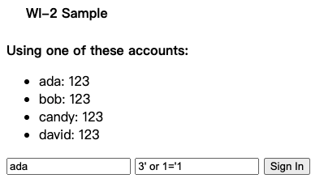
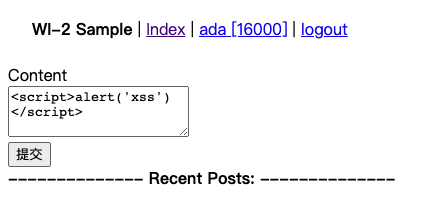

> 构建安全的Web应用
<!--more-->

---

### sql注入

> 下述表单提交，不知道用户密码也能登录成功



**成因：**

> 登录过程中进行数据库查询操作时，没有对参数进行检查或转义

``` python
def get_user2(name, passwd):
    sql = "SELECT * FROM user WHERE name='%s' and password='%s'"% (name, passwd)
    return db_exec(sql)
```

**修复**：

> 使用execute拼接sql，既对参数进行转义

``` python
def get_user2(name, passwd):
    # 对字符串转义
    return db_exec("SELECT * FROM user WHERE name=%s and password=%s", (name, passwd))
```

**why：**

> MySQLdb中对字符串进行转义，因此sql执行器不会去解析字符串

---

### xss攻击

> 下述表单提交后，重载页面就会弹出'xss'的框



**成因：**

> index渲染的时候没有对用户输入的数据做检查或转义

``` python
def render(file_path, data={}):
    encoding = 'utf-8'
    data = to_unicode(data, encoding)
    env = jinja2.Environment(loader=jinja2.FileSystemLoader('templates'))
    template = env.get_template(file_path)
    return template.render(**data).encode(encoding)
```

**修复：**

> jinja2渲染模版开启自动转义（autoescape=True）

``` python
def render(file_path, data={}):
    encoding = 'utf-8'
    data = to_unicode(data, encoding)
    # 开启自动转义
    env = jinja2.Environment(loader=jinja2.FileSystemLoader('templates'), autoescape=True)
    template = env.get_template(file_path)
    return template.render(**data).encode(encoding)
```

**why**：

> 转义之后浏览器不会去解析html标签或js代码等，因此可以防止用户内嵌其他页面（如广告），或提交有风险的js脚本

---

### csrf攻击

> 在攻击页面写入以下代码，若用户在此前已成功登录demo站点，则会自动向bob账户转账200

```html
<form id="form" action="http://www.demo.com/transfer" method="POST" style="display:none;">
    <input type="text" name="receiver" value="bob"/>
    <input type="text" name="amount" value="200"/>
</form>
<script>
    document.getElementById("form").submit();
</script>
```

**成因**

> 在transfer接口没有对请求做任何校验

```python
class Transfer(lib.AuthHandler):
    def post(self):
        receiver = self.request.get('receiver')
        amount = self.request.get('amount')
        if receiver and amount:
            amount = int(amount)
            name = self.session.get('user')
            db.transfer(name, receiver, amount)
        return self.redirect('/home')
```

**修复**

<u>*app/home.py*</u>

> 在访问表单页时记录当前的时间戳到cookie中，并在提交表单时校验ticket

```python
class Home(lib.AuthHandler):
    def get(self):
        user = db.get_user(self.session.get('user'))

        # cookie中添加一个时间戳，用session记录
        t = str(time.time())
        self.response.set_cookie('time', t)
        self.session.set('time', t)
        self.session.save()

        data = {'_user': user}
        return self.respond('home.html', data)
      
class Transfer(lib.AuthHandler):
    def post(self):
        receiver = self.request.get('receiver')
        amount = self.request.get('amount')
        ticket = self.request.get('ticket')

        # 检查正整数
        if receiver and lib.check_int(amount):
            amount = int(amount)
            name = self.session.get('user')

            # 检查ticket
            time = self.session.get('time')
            if lib.check_ticket(time, ticket):
                db.transfer(name, receiver, amount)
        return self.redirect('/home')
```

<u>*common/lib.py*</u>

> 相关检查

```python
# 检查正整数
def check_int(value):
    try:
        value = int(value)
        if value < 0:
            raise
    except:
        return False
    return True

# 检查ticket
def check_ticket(time, ticket):
    if time and time + 'haha' == ticket:
        return True
    return False
```

<u>*templates/home.html*</u>

> 在表单中增加一个ticket，ticket由在cookie里记录的时间戳生成

```html
<input type="hidden" name="ticket" id="ticket" value="">
<script>
   function getCookie(name) {
      var cookieName=encodeURIComponent(name) + '=';
      var cookieStart = document.cookie.indexOf(cookieName);
      var cookieValue = null;
      if (cookieStart > -1){
         var cookieEnd = document.cookie.indexOf(';', cookieStart);
         if (cookieEnd == -1) {
            cookieEnd = document.cookie.length;
         }
         cookieValue = decodeURIComponent(document.cookie.substring(cookieStart + cookieName.length,cookieEnd));
      }
      return cookieValue
   }
   document.getElementById("ticket").value = getCookie('time') + 'haha';
</script>
```

**why**

> 攻击者要求用户访问demo站点时虽然可以携带cookie，但攻击者并不能获取cookie，所以无法生成有效的ticket