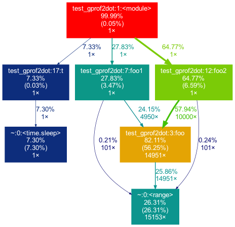

> Linux操作系统
<!--more-->

---

**1、是否能用管道做大数据量的通信，为什么？**

> 能，管道是在内核的一块缓冲区，由文件系统的高速缓冲区构成，虽然管道容量有限，但是合理分段的情况下可以较高效的传递大量数据

**2、写程序验证信号处理函数是否会被子进程继承**

```c
#include <stdio.h>
#include <unistd.h>
#include <stdlib.h>
#include <signal.h>

static void handler(int signum)
{
    printf("this signal is %d\n", signum);
}

int main()
{
    // 设置信号处理函数
    struct sigaction sa_usr;
    sa_usr.sa_flags = 0;
    sa_usr.sa_handler = handler;
    sigaction(SIGINT, &sa_usr, NULL);
 
    pid_t pid = 0;
    pid = fork();
    if(pid == 0)
    {
        printf("child\n");
        while (1) {}
    } else {
        sleep(1);
        printf("father\n");
        kill(pid, SIGINT);  // 发送信号
        sleep(1);
        kill(pid, SIGKILL);
    }
    return 0;
}
```

> 以上程序的运行结果是：
>
> child
> father
> this signal is 2
>
> 所以，子进程会继承父进程的信号处理函数

**3、分析cd命令是否会fork进程执行（需要写出分析过程）**

> 不会，cd命令会在shell启动时被加载并驻留在系统内存，因此不需要衍生出一个子进程

**4、关闭TCP连接时，为什么所绑定的端要处于TIME_WAIT状态2msl后才进入CLOSED状态，请解释TIME_WAIT状态的作用**

> 保证连接能可靠关闭：若对方在超时时间内没有收到ACK，则会重发FIN，而所绑定的端如果不等待2msl，则收不到重复的FIN；
>
> 保证本次连接的数据消失：在某些极端情况下，新的TCP连接不会混淆数据包。

**5、使用python+gprof2dot/FlameGraph分析一个应用程序。分析程序的调用情况，找出耗时的代码块。**

```python
import time

def foo(n): 
    for i in range(n):
        pass

def foo1(n):
    for i in range(n):
        for j in range(i):
            foo(j)

def foo2(n):
    for i in range(n):
        for j in range(n):
            foo(j)

def t():
    time.sleep(0.001)

if __name__ == '__main__':
    foo(100)
    foo1(100)
    foo2(100)
    t()
```

```shell
python -m cProfile -o test_gprof2dot.pstats test_gprof2dot.py
python -m gprof2dot -f pstats test_gprof2dot.pstats | dot -T png -o test_gprof2dot.png
```

> 得到的程序调用图如下，可以看到最耗时的是被调用了14951次的foo方法，其次是调用了foo方法10000次的foo2方法，再其次是调用了foo方法4950次的foo1方法，最后是1ms的sleep。

